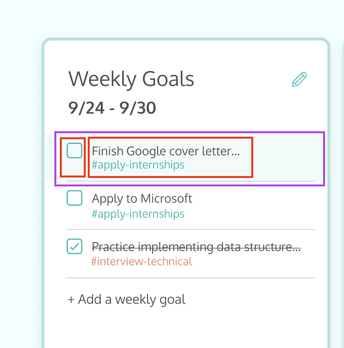

**Text is more in-line with Causeway style and roughly corresponds to the sections "Define and style elements" and "Position elements in a layout" from the original guide in terms of topics covered.**

*Text formatted according to [the style guide](https://docs.google.com/document/d/1KrUSlkgmklM7aqRV1VmsgT0ExjKpIeLW3cDXTEVrzEM/edit?usp=sharing)*

## Declare text elements
Let's get started on creating the weekly goals component. You can see the [full design](https://www.figma.com/design/EcsVaVYa8ecIg5J2GJAFA6WH/Compass-for-Causeway?node-id=0-1&t=qqCPJNDjdBvbIa00-1) for this component here, along with the other components we'll later implement in Causeway. For right now, we will identify and declare all the text elements of our component.

Let's start by focusing in on the individual items in the weekly goals - which we'll refer to as the component``weekly-goal-item``. We can have multiple weekly goals, so it makes sense to have each weekly goal be its own component for better efficiency and less code redundancy.

Let's start at the top of the component and work our way to the bottom of the component. Use the div tag to declare the text element Fall '18 Goals.

```
<div>Finish Google Cover Letter</div>
<div>#coverletter</div>
```


## Add selectors and style colors
Let's continue working on our Weekly Goals Item component. In Introduction to SCSS, we used element selectors to apply styles to all elements of a specific tag type. A more common approach is to add class attributes to HTML tags that allow one to target that specific element or a group of elements with common styles. Add class attributes to the card title using the following:
```
<div class="goal-title">Finish Google Cover Letter</div>
<div class="goal-hashtag">#coverletter</div>
```

To apply styles to all elements with a given class, use a . followed by the class value. Use this to specify the color of the title by adding the below code to our component's SCSS file, ``weekly-gooal-item.component.scss``:
```
.goal-title {
   color: #4B5853;
}

.goal-hashtag {
   goal-title: #2DBDB1;
}
```

## Using the Angular Material Library
Referring back to our component's [designs](https://www.figma.com/design/EcsVaVYa8ecIg5J2GJAFA6WH/Compass-for-Causeway?node-id=0-1&t=qqCPJNDjdBvbIa00-1), we should be able to check a goal off to mark it as completed. Any completed goals should remain checked, unless we decide to unmark it to be an incomplete goal again. Creating an element like a robust checkbox would be hard to do on our own, which is why many frameworks have their own or third-party material components library. For Angular, the most popular material component library is [Angular Material](https://material.angular.io/). This library gives us common reliable components to work without any headache. You'll find there's many other things it offers besides checkboxes (such as menus, buttons, etc.), so have a [look for yourself](https://material.angular.io/components/categories).

We can import Angular Material's checkbox component into our Weekly Goal Item component by modifying ``weekly-goal-item.component.ts`` like so:
```
import { MatCheckbox } from '@angular/material/checkbox';

@Component({
  selector: 'app-weekly-goal-item',
  templateUrl: './weekly-goal-item.component.html',
  styleUrls: ['./weekly-goal-item.component.scss'],
  changeDetection: ChangeDetectionStrategy.OnPush,
  animations: [WeeklyGoalItemAnimations],
  imports: [
    MatCheckbox,
  ],
  standalone: true,
})
```

Because our Weekly Goal Item component is considered a standalone component, we can import the ``mat-checkbox`` component easily. Switching back to our html file now, we can add in our checkbox:
```
<li class="weekly-goal">
   <mat-checkbox class="check-box"></mat-checkbox>
   <div class="goal-title">Finish Google Cover Letter</div>
   <div class="goal-hashtag">#coverletter</div>
   </div>
</li>
```

You'll notice when this renders that the styling is a little bit off. We can address this easily using flexbox styling, which we'll cover in the next section.

## Position Elements in a Layout

To implement flexbox styling properly for our component, we need to first identify how we'd like to group our elements to best match our design. The figure below shows some potential groupings. 

*Citation for below paragraph: Original Causeway*

Besides what is necessary to make sure all elements in a group are laid out vertically or horizontally, it is also common to define divs that correspond to a conceptual portion of the view (e.g. the "card header", the "tasks", or a "task") or to define divs corresponding to portions of the component that have a background or border (e.g. for the entire card).


In ``weekly-goal-item.component.html``, let's add an li tag around all our elements to group them all together. We're choosing to use an li for this as it makes the most sense semantically within the larger context of our app Compass Goals, as Weekly Goal Items' parent container, Weekly Goals (we'll implement this later), is essentially a list of Weekly Goal Items. You can think of the future structure of Weekly Goals as similar to this:
```
<div>Weekly Goals</div>
<ul>
   <li>Weekly Goal 1</li>
   <li>Weekly Goal 2</li>
   <li>Weekly Goal 3</li>
</ul>
```
which will ultimately evolve into something more along the lines of this:
```
<div>Weekly Goals</div>
<ul>
   <app-weekly-goal-item/>
   <app-weekly-goal-item/>
   <app-weekly-goal-item/>
</ul>
```
That's why we're using the li tag for Weekly Goal Item. 

We'll also be updating the rest of hierarchy to better reflect the groupings we made earlier in our diagram, so we'll some more divs (with the class names "goal-details" and "bottom-row") around the divs for our goal's title and hashtags.
```
<li class="weekly-goal">
  <mat-checkbox class="check-box"></mat-checkbox>
  <div class="goal-details">
    <div class="goal-title">Finish Google Cover Letter</div>
    <div class="bottom-row">
      <div class="goal-hashtag">#coverletter</div>
    </div>
  </div>
</li>
```

```
$goal-hover-background: rgba(204, 239, 236, 0.25);
$divider-color: rgba(0, 0, 0, 0.15);

.weekly-goal {
  display: flex;
  width: 100%;
  margin: 0;
  padding: 4px 0px;
  border-bottom: 1px solid $divider-color;

  &:hover {
    background: $goal-hover-background;
  }
  .goal-details {
    cursor: pointer;
    flex: 1;
    width: 100%;
    .goal-title {
      margin: 0;
      font-size: 16px;
      padding: 10px 0px 4px 0px;
    }
    .bottom-row {
      display: flex;
      .goal-hashtag {
        font-size: 13px;
        font-weight: 400;
      }
    }
  }
}
```